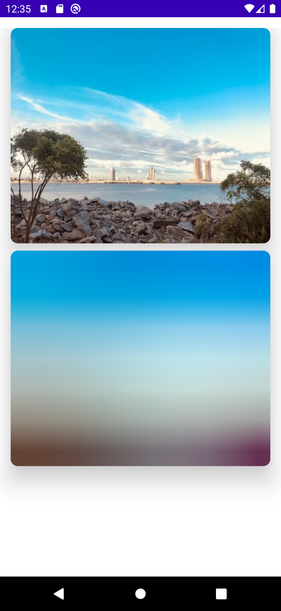
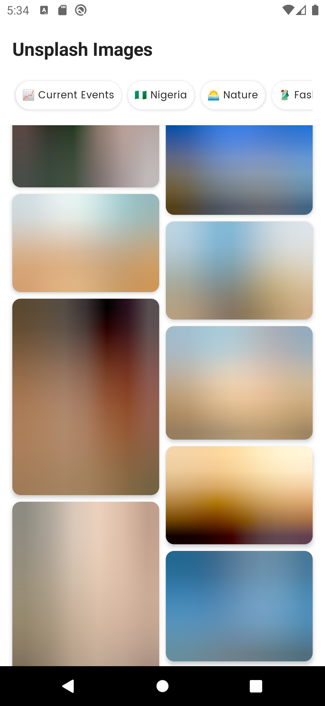

# ComposeBlurHash 🎨

[](https://jitpack.io/#dalafiarisamuel/composeblurhash)
[](https://github.com/dalafiarisamuel/composeblurhash/actions/workflows/validate-binary.yml)

**ComposeBlurHash** is a Jetpack Compose library that provides a simple way to display [BlurHash](https://blurha.sh/) placeholders while your high-resolution images are loading from the web.

## 🚀 Installation

### 1. Add JitPack to `settings.gradle.kts`

Add the JitPack repository to your `dependencyResolutionManagement` block:

```kotlin
dependencyResolutionManagement {
    repositories {
        google()
        mavenCentral()
        maven { url = uri("https://jitpack.io") }
    }
}
```

### 2. Add Dependency

#### Using Version Catalog (Recommended)
Add this to your `gradle/libs.versions.toml`:

```toml
[versions]
composeblurhash = "1.0.3"

[libraries]
composeblurhash = { module = "com.github.dalafiarisamuel:composeblurhash", version.ref = "composeblurhash" }
```

Then, add it to your module's `build.gradle.kts`:

```kotlin
dependencies {
    implementation(libs.composeblurhash)
}
```

#### Using traditional Gradle DSL
```kotlin
dependencies {
    implementation("com.github.dalafiarisamuel:composeblurhash:1.0.3")
}
```

## 📖 Usage

### 1. Simple Image Placeholder
Use `rememberBlurHashPainter` to create a painter that decodes the BlurHash string into a blurred image.

```kotlin
@Composable
fun BlurHashImageSample() {
    val blurHashPainter = rememberBlurHashPainter(
        blurString = "LvF7o6RiV@ofL4j?ozay4ptQkCfk",
        width = 4032,
        height = 3024,
    )

    Card(
        shape = RoundedCornerShape(10.dp),
        modifier = Modifier.fillMaxWidth().height(250.dp)
    ) {
        Image(
            painter = blurHashPainter,
            contentDescription = "Blurred Placeholder",
            contentScale = ContentScale.Crop,
            modifier = Modifier.fillMaxSize()
        )
    }
}
```

### 2. Integration with Coil
You can use `rememberBlurHashPainter` as a `placeholder` or `error` painter in **Coil**.

```kotlin
@Composable
fun BlurHashCoilIntegration() {
    val placeholder = rememberBlurHashPainter(
        blurString = "LvF7o6RiV@ofL4j?ozay4ptQkCfk",
        width = 4032,
        height = 3024,
    )

    AsyncImage(
        model = "https://example.com/high_res_image.jpg",
        contentDescription = "Loading Image",
        placeholder = placeholder,
        error = placeholder,
        contentScale = ContentScale.Crop,
        modifier = Modifier.fillMaxWidth().height(250.dp)
    )
}
```

## 🌟 Apps using ComposeBlurHash
- [unsplash-api-compose](https://github.com/dalafiarisamuel/unsplash-api-compose) - A project to display images from Unsplash API using Jetpack Compose.

## 📸 Screenshots
<p align="center">
  
  
</p>

## 📄 License
This project is licensed under the MIT License - see the [LICENSE](LICENSE) file for details.
